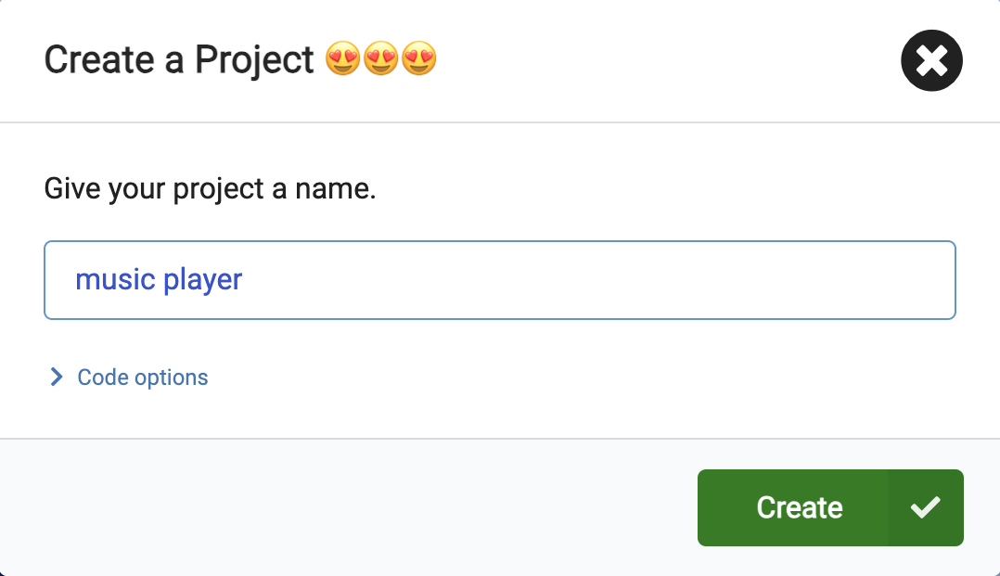
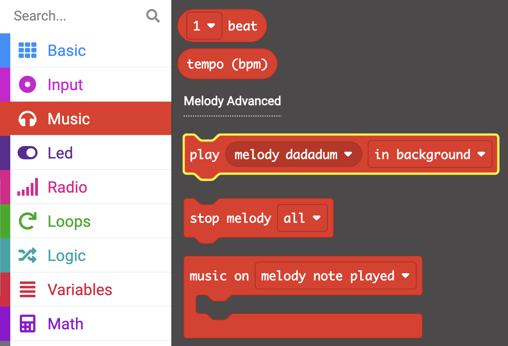

## Play a tune

### Opening MakeCode

To get started creating your micro:bit project, you will need to open the MakeCode editor.

--- task ---

Open the MakeCode editor at [makecode.microbit.org](https://makecode.microbit.org){:target="_blank"}

--- collapse ---

---
title: Offline version of the editor
---

There is also a [downloadable version of the MakeCode editor](https://makecode.microbit.org/offline-app){:target="_blank"}.

--- /collapse ---

--- /task ---

Once the editor is open, you will need to create a New Project and give your project a name. 

--- task ---

Click on the **New Project** button.

--- /task ---

--- task ---

Give your new project the name `music player` and click **Create**.

**Tip:** Give your project a helpful name that relates to the activity you’re creating. This will make it easier to find if you create other projects on MakeCode.

--- /task ---

[[[makecode-tour]]]

### Play melody

You are going to use the `forever` block to make use of the speaker output on the micro:bit (V2 users only).

--- collapse ---
---
title: V1 micro:bit users
---

The speaker output is only available on the V2 of the micro:bit. You will need to connect external headphones/speakers to play sound on the V1. You will still be able to play the sound on the simulator.

--- /collapse ---

--- task ---

From the music block, drag the `play melody... dadadum.. in background` block and place it inside the `forever` block.

--- /task ---

--- task ---

On the `play melody... dadadum.. in background` block, click on the down arrow next to the 'in background' button. Choose 'until done' as the option for how long the melody will play.

<iframe style="position:relative;top:0;left:0;width:75%;height:75%;" src="https://makecode.microbit.org/---codeembed#pub:_Tr00PpKK07YM" allowfullscreen="allowfullscreen" frameborder="0" sandbox="allow-scripts allow-same-origin"></iframe>

--- /task ---

When you make a change to a code block in the code editor panel, the simulator will restart.

**Test** When the program runs, you should now hear the melody playing until it's done (and then looping because of the forever loop!).

Well done, you have created your first music program on a micro:bit!
