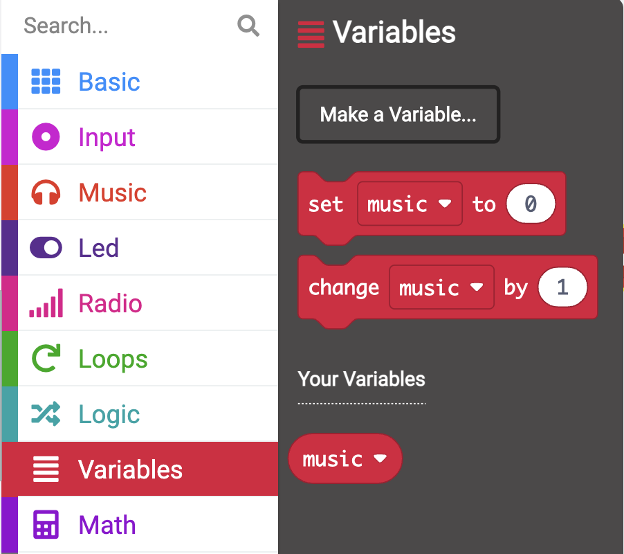

## Allowing Choices

### Creating a variable

Throughout creating your music player, you will need to use variables. 

What is a variable? 
A variable is a special box where we can keep different pieces of information. Sometimes it might hold a number like '10' or it might hold a word like 'dinosaur'. 

--- task ---

Click on the `Variables` menu to expand it. When open, click on the `Make a Variable` button.

--- /task ---

--- task ---

Name your variable `music`, then click the `OK` button.

--- /task ---

There will now be new blocks available that you can use to set, change or use the value stored in the `music` variable. 

--- task ---

Drag out the `set [music] to 0` block inside the `onstart` block and change the `0` to `1`.

<iframe style="position:relative;top:0;left:0;width:75%;height:75%;" src="https://makecode.microbit.org/---codeembed#pub:_Uc9i2pPpFgYU" allowfullscreen="allowfullscreen" frameborder="0" sandbox="allow-scripts allow-same-origin"></iframe>

--- /task ---

### Using Conditional logic

--- task ---

Step content... 
Can use:
**Test:**
**Choose:**
**Tip:**

--- /task ---

--- save ---