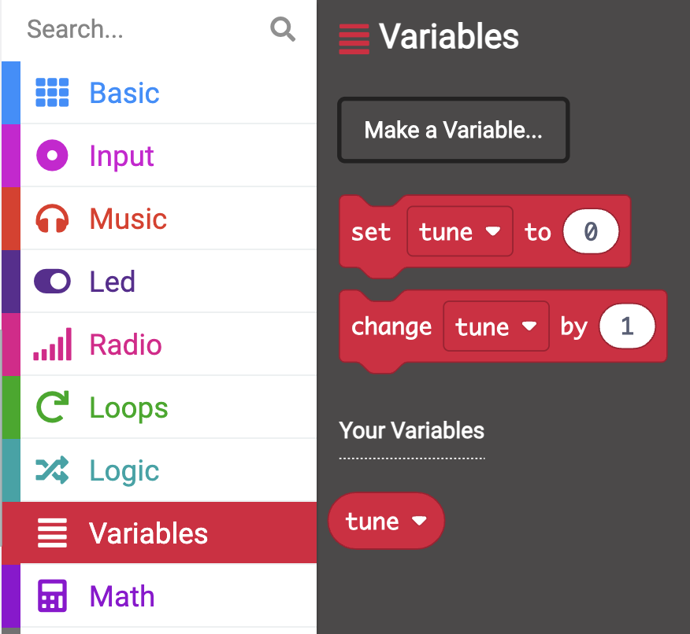

## Allowing Choices

### Creating a variable

Throughout creating your music player, you will need to use variables. 

What is a variable?

A variable is like a special box where we can keep different pieces of information. Sometimes it might hold a number like `10` or it might hold a word like `dinosaur`.

--- task ---

Open the <code style="background-color: #DC143C">Variables</code> menu, and click **Make a Variable**.

--- /task ---

--- task ---

Name the new variable `tune`, then click the `Ok` button.

--- /task ---

There will now be new blocks available that you can use to set, change or use the value stored in the <code style="background-color: #DC143C">tune</code> variable. 

--- task ---

Drag out the <code style="background-color: #DC143C">set</code>block and place it inside the <code style="background-color: #1E90FF">on start</code> block.

Change the `0` to `1`.

<iframe style="position:relative;top:0;left:0;width:50%;height:100%;" src="https://makecode.microbit.org/---codeembed#pub:_MHwLMFgh3Duz" allowfullscreen="allowfullscreen" frameborder="0" sandbox="allow-scripts allow-same-origin"></iframe>

--- /task ---

### Using if... then

In order for your music player to play different melody choices, you will need to make use of a logic block for each melody.

--- task ---

From the <code style="background-color: #00A4A6">Logic</code> menu, grab an <code style="background-color: #00A4A6">if</code> block and place it above the <code style="background-color: #E63022">play melody dadadum</code> block.

--- /task ---

--- task ---

Click on the <code style="background-color: #00A4A6">Logic</code> menu and drag out a comparison <code style="background-color: #00A4A6">0 = 0</code> block. 

Place this in the <code style="background-color: #00A4A6">true</code> area of the <code style="background-color: #00A4A6">if</code> block.

<iframe style="position:relative;top:0;left:0;width:75%;height:100%;" src="https://makecode.microbit.org/---codeembed#pub:_WrzDXU4KKeRY" allowfullscreen="allowfullscreen" frameborder="0" sandbox="allow-scripts allow-same-origin"></iframe>

--- /task ---

--- task ---

From the <code style="background-color: #DC143C">Variables</code> menu, drag out a <code style="background-color: #DC143C">tune</code> block. 

Place it into the first `0` in the <code style="background-color: #00A4A6">0 = 0</code> block.

Change the second `0` to `1`.

<iframe style="position:relative;top:0;left:0;width:75%;height:100%;" src="https://makecode.microbit.org/---codeembed#pub:_HyH5uA1iA80o" allowfullscreen="allowfullscreen" frameborder="0" sandbox="allow-scripts allow-same-origin"></iframe>

--- /task ---

--- task ---

Move the <code style="background-color: #E63022">play melody dadadum</code> block inside the <code style="background-color: #00A4A6">if</code> block.

<iframe style="position:relative;top:0;left:0;width:75%;height:75%;" src="https://makecode.microbit.org/---codeembed#pub:_40uahb1ahe5k" allowfullscreen="allowfullscreen" frameborder="0" sandbox="allow-scripts allow-same-origin"></iframe>

--- /task ---

To add more melody choices, you need to create more conditions in the <code style="background-color: #00A4A6">if</code> block.

--- task ---

Click on the `+` symbol on the bottom left of the <code style="background-color: #00A4A6">if</code> block. This will create an <code style="background-color: #00A4A6">else</code> section. 

--- /task ---

--- task ---

Click on the `+` symbol below the <code style="background-color: #00A4A6">else</code> section. 

This will create an <code style="background-color: #00A4A6">else if</code> section. 

Repeat this twice, so you have three <code style="background-color: #00A4A6">else if</code> sections and an <code style="background-color: #00A4A6">else</code> section.

--- /task ---

--- task ---

Click on the `-` symbol next to the <code style="background-color: #00A4A6">else</code> section to remove the <code style="background-color: #00A4A6">else</code> section.

--- /task ---

--- task ---

Right click on the <code style="background-color: #DC143C">tune</code> <code style="background-color: #00A4A6">=</code> `1` block and duplicate it.

--- /task ---

--- task ---

Place the duplicated <code style="background-color: #DC143C">tune</code> <code style="background-color: #00A4A6">=</code> `1` block between the first <code style="background-color: #00A4A6">else if</code> and <code style="background-color: #00A4A6">then</code>. 

Duplicate two more comparison blocks and place them between the other <code style="background-color: #00A4A6">else if</code> and <code style="background-color: #00A4A6">then</code> parts.

--- /task ---

--- task ---

Inside the first <code style="background-color: #00A4A6">else if</code> section, change the `1` to `2`.

For the second <code style="background-color: #00A4A6">else if</code> section, change the `1` to `3`. 

For the third <code style="background-color: #00A4A6">else if</code> section, change the `1` to `4`

<iframe style="position:relative;top:0;left:0;width:75%;height 100%;" src="https://makecode.microbit.org/---codeembed#pub:_HM28gkfiieR4" allowfullscreen="allowfullscreen" frameborder="0" sandbox="allow-scripts allow-same-origin"></iframe>

--- /task ---

You will now need to select a different melody for each <code style="background-color: #00A4A6">else if</code> section. 

Each time the variable value is changed, a different melody will play.

--- task ---

Duplicate the <code style="background-color: #E63022">play melody dadadum</code> block. 

Place the duplicated block inside the first <code style="background-color: #00A4A6">else if</code> section. 

Click on the arrow next to <code style="background-color: #E63022">melody dadadum</code> to see more melody options. 

Scroll to view all the melodies and choose one. 

Repeat these steps for the second and third <code style="background-color: #00A4A6">else if</code> sections. 

You should now have four melodies, one for each of the four conditions.

<iframe style="position:relative;top:0;left:0;width:75%;height:100%;" src="https://makecode.microbit.org/---codeembed#pub:_f5DefxebuH6c" allowfullscreen="allowfullscreen" frameborder="0" sandbox="allow-scripts allow-same-origin"></iframe>

--- /task ---

--- task ---

**Debug:** Ensure you have changed all the numbers in the comparisons after duplicating them. 

You should have `1` in the <code style="background-color: #00A4A6">if</code> section and then `2,3,4` in the <code style="background-color: #00A4A6">else if</code> sections.

--- /task ---

--- task ---

**Test:** your program.

Check that all your code is working well. 

Well done, you have chosen different melodies for your music player!

--- /task ---