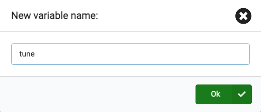
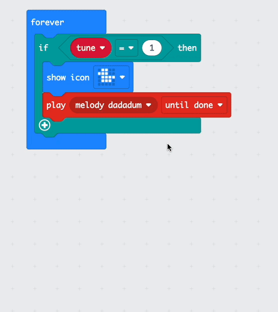
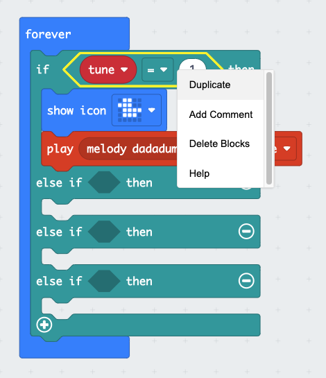

## Allowing Choices

### Creating a variable

Throughout creating your music player, you will need to use variables. 

What is a variable?

A variable is like a special box where we can keep different pieces of information. Sometimes it might hold a number like `10` or it might hold a word like `dinosaur`.

--- task ---

Click on the `Variables` block menu to expand it. When open, click on the `Make a Variable` button.

--- /task ---

--- task ---

Name your variable `tune`, then click the `OK` button.

--- /task ---

There will now be new blocks available that you can use to set, change or use the value stored in the `tune` variable. 

--- task ---

Drag out the `set [tune] to 0` block inside the `on start` block and change the `0` to `1`.

<iframe style="position:relative;top:0;left:0;width:75%;height:75%;" src="https://makecode.microbit.org/---codeembed#pub:_MHwLMFgh3Duz" allowfullscreen="allowfullscreen" frameborder="0" sandbox="allow-scripts allow-same-origin"></iframe>

--- /task ---

### Using conditional logic

In order for your music player to play different melody choices, you will need to make use of a logic block for each melody.

--- task ---

From the Logic block menu, click on the `if.. true.. then` block and drag it inside the `forever` block. It should click in place above the `play melody... dadadum.. until forever` block

--- /task ---

--- task ---

Click on the Logic block menu again and this time, you will need to drag out a comparison `0=0` block. Drag this into the `true` area on the `if.. true.. then` block and make sure it fits in place.

<iframe style="position:relative;top:0;left:0;width:75%;height:75%;" src="https://makecode.microbit.org/---codeembed#pub:_WrzDXU4KKeRY" allowfullscreen="allowfullscreen" frameborder="0" sandbox="allow-scripts allow-same-origin"></iframe>

--- /task ---

--- task ---

From the Variables block menu, drag out a `tune` variable block. Place it into the first `0` area on the comparison block inside the C. Change the second `0` to `1`.

<iframe style="position:relative;top:0;left:0;width:75%;height:75%;" src="https://makecode.microbit.org/---codeembed#pub:_HyH5uA1iA80o" allowfullscreen="allowfullscreen" frameborder="0" sandbox="allow-scripts allow-same-origin"></iframe>

--- /task ---

--- task ---

Now click on the `play melody... dadadum.. until done` block and place it inside the `if.. tune = 0.. then` block.

<iframe style="position:relative;top:0;left:0;width:75%;height:75%;" src="https://makecode.microbit.org/---codeembed#pub:_40uahb1ahe5k" allowfullscreen="allowfullscreen" frameborder="0" sandbox="allow-scripts allow-same-origin"></iframe>

--- /task ---

To add more melody choices, you need to create more conditions within the `if.. true.. then` block. This will create `else.. if` conditions.

--- task ---

Click on the `+` symbol on the bottom left of the `if... then` block. This will create an `else` block. 

--- /task ---

--- task ---

Click on the `+` symbol below the  `else` block. This will create an `else if... then` block. Repeat this two more times until you have three `else if... then` blocks.

--- /task ---

--- task ---

Now click on the `-` symbol next to the `else` block to remove the `else` block.

--- /task ---

--- task ---

Right click on the entire comparison `tune = 1` block and then duplicate it.

--- /task ---

--- task ---

Place the duplicated comparison block inside the empty shaped space on the 
--- /task ---

--- task ---

Step content... 
Can use:
**Test:**
**Choose:**
**Tip:**

--- /task ---

--- save ---