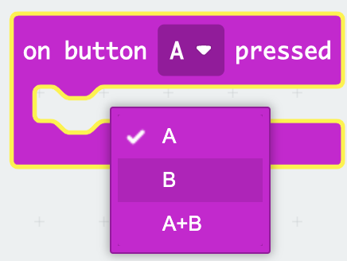

## Using the buttons to skip tunes

Instead of changing the melody by changing the `tune` variable value in the `on start` block, you can use buttons to change the value (and, therefore, the melody). 

In this step you will create code to skip tracks using the micro:bit's event handlers.

What is anevent handler?

An event handler is code that is associated with a particular event, such as “button A pressed”.

You create (or register) the link between an event and an event handler by calling a function named “on “.

### Adding button controls

The micro:bit contains a Button `A` and a Button `B`.

You can use an event to control what happens when a button is pressed.

### Skipping to the next track

Button B is on the right, so we will use this button to skip to the next track.

To do this you need to change the value of the <code style="background-color: #DC143C">tune</code> variable by `1`.

--- task ---

From the <code style="background-color: #D400D4">Input</code> menu, drag the <code style="background-color: #D400D4">on button </code> block to the code editor panel.

--- /task ---

--- task ---

Click on the arrow next to `A` on the <code style="background-color: #D400D4">on button </code> block. 

Change the `A` to `B`

--- /task ---

#### Stop all sounds!

Now, you need to stop the current tune. 

--- task ---

From the <code style="background-color: #E63022">Music</code> menu, drag the <code style="background-color: #E63022">stop all sounds</code> block.

 Place it in the <code style="background-color: #D400D4">on button [B]</code> block in the code editor panel.

<iframe style="position:relative;top:0;left:0;width:100%;height:100%;" src="https://makecode.microbit.org/---codeembed#pub:_MLDi2adDz8u7" allowfullscreen="allowfullscreen" frameborder="0" sandbox="allow-scripts allow-same-origin"></iframe>

--- /task ---

--- task ---

From the <code style="background-color: #DC143C">Variables</code> menu drag the <code style="background-color: #DC143C">change </code> block.

Place it below the <code style="background-color: #E63022">stop all sounds</code> block.

<iframe style="position:relative;top:0;left:0;width:100%;height:100%;" src="https://makecode.microbit.org/---codeembed#pub:_7oT6My8u3869" allowfullscreen="allowfullscreen" frameborder="0" sandbox="allow-scripts allow-same-origin"></iframe>

--- /task ---

#### Dealing with 'out of range'

If the value of the variable is `1`, then changing it by `-1` will make the value `0`.
(1 - 1 = 0)

🚨 But there is no melody associated with the value `0`! 🚨

And if you keep going, you will go from 0 to -1, then -2, -3, -4, -5 and so on!

We need to deal with this and stop this from happening!

We need to make sure the lowest number that the variable value can be is `1`, because our melodies start at 1:

<iframe style="position:relative;top:0;left:0;width:100%;height:100%;" src="https://makecode.microbit.org/---codeembed#pub:_HM28gkfiieR4" allowfullscreen="allowfullscreen" frameborder="0" sandbox="allow-scripts allow-same-origin"></iframe>

--- task ---

Click on the <code style="background-color: #00A4A6">Logic</code> menu and drag out the <code style="background-color: #00A4A6">if</code> block.

Place it below the <code style="background-color: #DC143C">change tune</code> block in your code.

<iframe style="position:relative;top:0;left:0;width:100%;height:100%;" src="https://makecode.microbit.org/---codeembed#pub:_0PcDtthUHHMv" allowfullscreen="allowfullscreen" frameborder="0" sandbox="allow-scripts allow-same-origin"></iframe>

--- /task ---

--- task ---

Also from the <code style="background-color: #00A4A6">Logic</code> menu, drag a <code style="background-color: #00A4A6">0 < 0</code> block.

Place it inside the `true` part of the <code style="background-color: #00A4A6">if</code> block.

Change the `<` (less than) to `>` (greater than) by clicking on the arrow next to the `<` symbol.

<iframe style="position:relative;top:0;left:0;width:100%;height:100%;" src="https://makecode.microbit.org/---codeembed#pub:_AbbWoKdWF49y" allowfullscreen="allowfullscreen" frameborder="0" sandbox="allow-scripts allow-same-origin"></iframe>

--- /task ---

--- task ---

From the <code style="background-color: #DC143C">Variables</code> menu, drag out the <code style="background-color: #DC143C">tune</code> variable  block.

Place it on the first `0` in the <code style="background-color: #00A4A6">0 < 0</code> block.

<iframe style="position:relative;top:0;left:0;width:100%;height:100%;" src="https://makecode.microbit.org/---codeembed#pub:_Ewj1DVgptdvg" allowfullscreen="allowfullscreen" frameborder="0" sandbox="allow-scripts allow-same-origin"></iframe>

Change the second `0` to a `4`.

<iframe style="position:relative;top:0;left:0;width:100%;height:100%;" src="https://makecode.microbit.org/---codeembed#pub:_Afad2qUqoerT" allowfullscreen="allowfullscreen" frameborder="0" sandbox="allow-scripts allow-same-origin"></iframe>

--- /task ---

--- task ---

From the <code style="background-color: #DC143C">Variables</code> menu and drag out the <code style="background-color: #DC143C">set</code> block.

Place it inside the `code style="background-color: #00A4A6">if</code> block in your code. 

Change the `0` to `1`.

<iframe style="position:relative;top:0;left:0;width:100%;height:100%;" src="https://makecode.microbit.org/---codeembed#pub:_CYoDaD5aC7jw" allowfullscreen="allowfullscreen" frameborder="0" sandbox="allow-scripts allow-same-origin"></iframe>

--- /task ---

#### Skipping to the previous track

Button A is on the left, so we will use this button to skip to the previous track.

To do this we need to change the value of the `tune` variable by `-1`.

We can re-use our code we created to control what happens when Button B is pressed.

--- task ---

**Right click** on the top part of the <code style="background-color: #D400D4">on button B pressed</code> block that you now have in the code editor panel. 

Click `Duplicate` to make a copy of the whole block. 

You should now have a second code style="background-color: #D400D4">on button B pressed</code> block that will be 'greyed out'.

Make these changes to the 'greyed out' block:

+ Change the button from `B` to `A` (doing this will stop the block from being greyed out).
+ Change the `-1` to `1`
+ Change the `<` to `>`
+ Change the `1` to `4`
+ Change the `4` to `1`

You should now have an code style="background-color: #D400D4">on button A pressed</code> block of code and an code style="background-color: #D400D4">on button B pressed</code> block of code:

<iframe style="position:relative;top:0;left:0;width:100%;height:100%;" src="https://makecode.microbit.org/---codeembed#pub:_CbfbVkYrt0iW" allowfullscreen="allowfullscreen" frameborder="0" sandbox="allow-scripts allow-same-origin"></iframe>

--- /task ---
**Debug** Make sure you have changed the correct values in the blocks used to change the value of the variables. For example: `Button A` should change the variable by `-1` and Button B should change the variable value by `1`.

When you make a change to a code block in the code editor panel, the simulator will restart.

**Test** 

+ Press Button A 

+ Press Button B

Well done, you can now skip your tracks!
