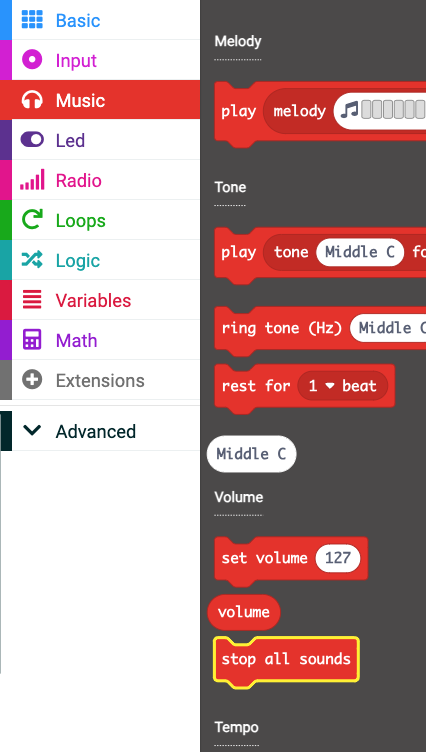
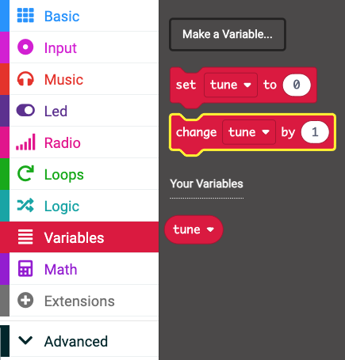

## Using the buttons to skip tunes

Instead of changing the melody by changing the `tune` variable value in the `on start` block, you can use buttons to change the value (and, therefore, the melody). 

<iframe style="position:relative;top:0;left:0;width:75%;height:75%;" src="https://makecode.microbit.org/---codeembed#pub:_XXXXXXXXXXXX" allowfullscreen="allowfullscreen" frameborder="0" sandbox="allow-scripts allow-same-origin"></iframe>

### Adding button controls

The micro:bit contains an `A` button, and a `B` button.

You can use a block to control what happens when a button is pressed.

--- task ---

Click on the `Input` block menu to expand it and drag the `on button [A] pressed` block to the code editor panel.

--- /task ---

#### Stop all sounds!

First, we need to stop the current tune. 

--- task ---

Click on the `Music` block menu to expand it and drag the `stop all sounds` block to the `on button [A] pressed` block in the code editor panel.

<iframe style="position:relative;top:0;left:0;width:75%;height:75%;" src="https://makecode.microbit.org/---codeembed#pub:_6FTWXk9WTLym" allowfullscreen="allowfullscreen" frameborder="0" sandbox="allow-scripts allow-same-origin"></iframe>

--- /task ---

#### Increase the value of the variable

Button A is on the left, so we will use this button to skip to the previous track.

To do this we need to change the value of the `tune` variable by `-1`.

--- task ---

Click on the `Variables` block menu to expand it and drag the `change [tune] by [1]` block below the `stop all sounds` block in your code.

In the `change [tune] to [1]` block, change the value `1` to `-1`.

<iframe style="position:relative;top:0;left:0;width:75%;height:75%;" src="https://makecode.microbit.org/---codeembed#pub:_bk1aXfP6ob1E" allowfullscreen="allowfullscreen" frameborder="0" sandbox="allow-scripts allow-same-origin"></iframe>

--- /task ---

#### Dealing with 'out of range'

If the value of the variable is 1, then changing it by -1 will make the value 0 

🚨 **But there is no melody associated with the value 0!** 🚨

We need to deal with this!

--- task ---

--- /task ---

--- task ---

**Debug** Make sure you have changed the correct values in the blocks used to change the value of the variables. `Button A` should change the variable by `-1` and Button B should change the variable value by `1`.

Step content... 
Can use:
**Test:**
**Choose:**
**Tip:**

--- /task ---

--- save ---